CUDA Rasterizer
===============

[CLICK ME FOR INSTRUCTION OF THIS PROJECT](./INSTRUCTION.md)

**University of Pennsylvania, CIS 565: GPU Programming and Architecture, Project 4**

* Rishabh Shah
* Tested on: Windows 10, i7-6700HQ @ 2.6GHz 16GB, GTX 960M 4096MB (Laptop)

## Overview
In this project, I implemented a Rasterizer using CUDA. Rasterization is a technique used to draw 3D geometry on the screen in real-time. The geometry is in the form of vertices which are to be converted into geometry primitives (like triangles), and plotted on the screen.

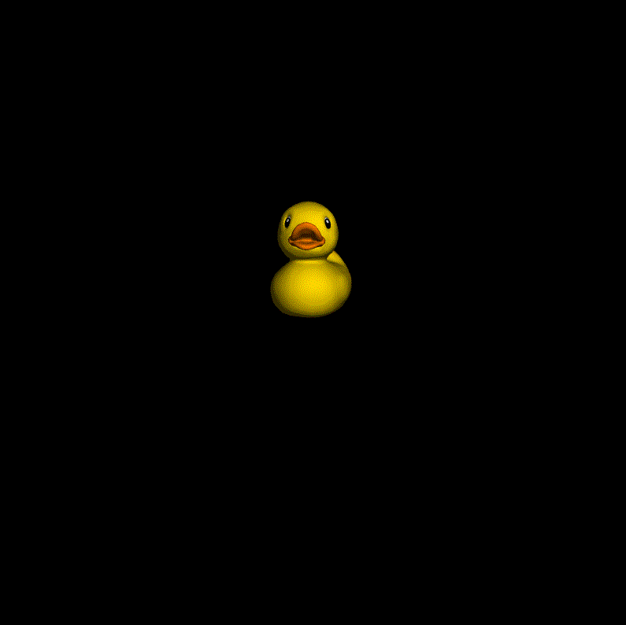

*the artefacts are due to gif compression and is not seen during actual run of the program*

## Functionalities Implemented

* Pipeline Stages:
    * Vertex shading (`_vertexTransformAndAssembly` in `rasterize.cu`)
    * Primitive assembly (`_primitiveAssembly` in `rasterize.cu`)
    * Rasterization (`_rasterizeTriangles` in `rasterize.cu`)
    * Fragment shading (Partly in `_rasterizeTriangles`, partly in `render` in `rasterize.cu`)
    * Depth buffer for depth testing
    * Fragment-to-depth-buffer writing with atomics for race avoidance.
    * Lambert shading. (Inside `render` in `rasterize.cu`)

* Additional Features:
    * Post processing shader: Gaussian blur, with and without shared memory
    * Additional pipeline stage:
        * Backface culling, with and without stream compaction
        * Blend for simulating depth of field
    * UV texture mapping with bilinear texture filtering and perspective
      correct texture coordinates
    * Supersample antialiasing (SSAA)
    * Support for rasterizing additional primitives:
       * Lines
       * Points

#### Minor optimizations

* Using `constant memory` for storing constant variables
* Avoid if-else statements wherever possible
* As few global memory reads as possible
* Ignore the triangles during rasterization if the bounding box is outside the camera's view frustum

## Results

#### Lambertian Shading and Debug Views

I create simple implementations for a few debug views to help me visualize what's going on.

| Lambertian | Depth | Normals |
| ----- | ----- | ----- |
| 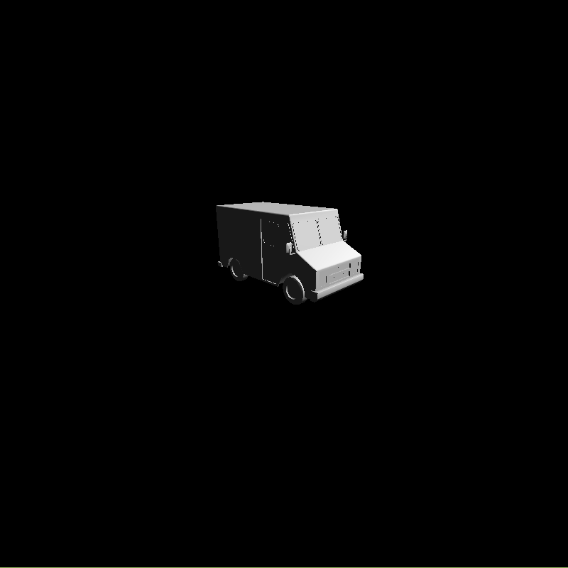 | 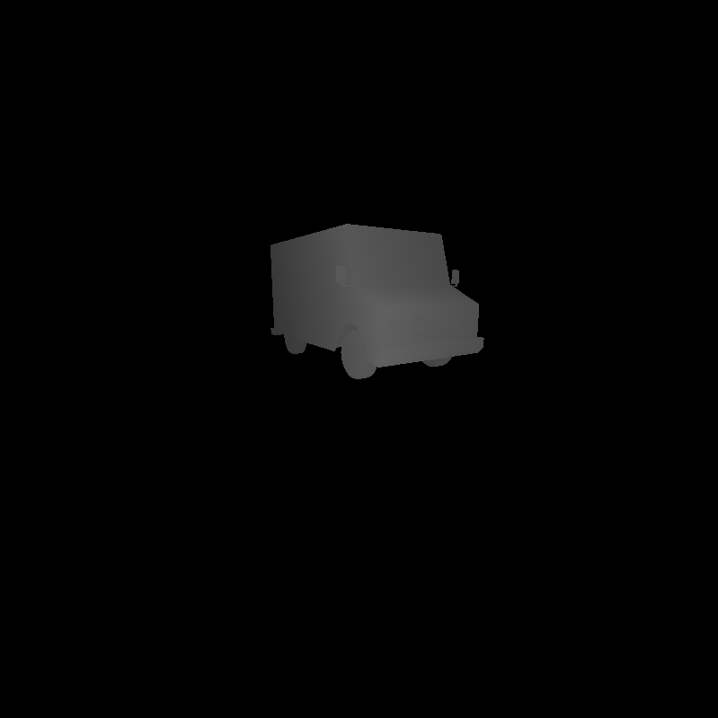 | 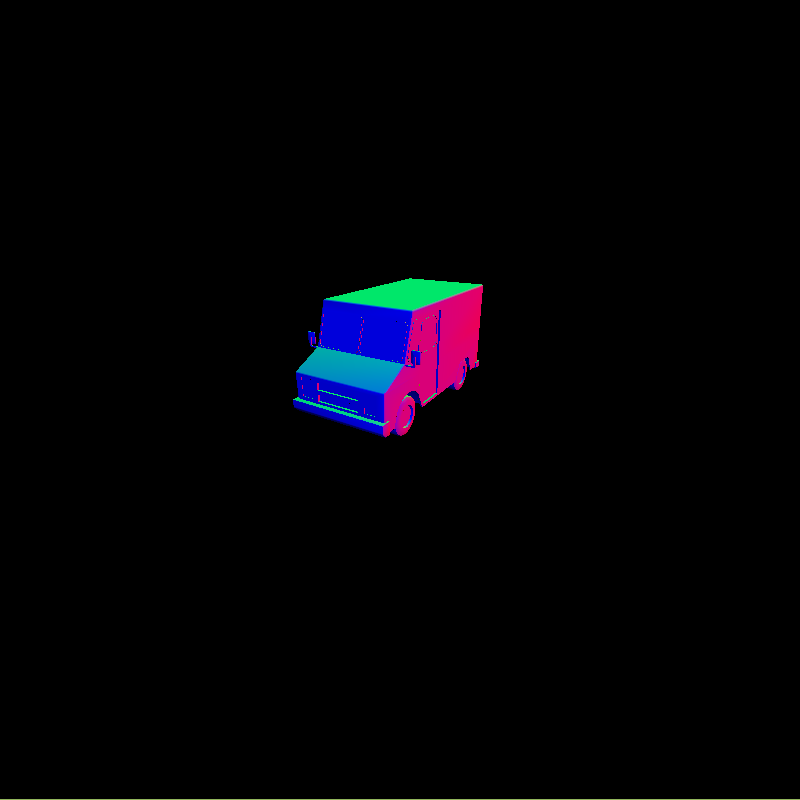 |

#### Texturing

The first image is of naive UV mapping. The checkerboard looks incorrect because the UVs are interpolated without taking into account the perspective diminishing along the Z-axis. Performing perspective correct z-interpolation results in a correct result. Bilinear filtering further enhances the output by smoothing out sharp edges in the texture.

| Texture | Perspective correction | Bilinear filtering |
| ----- | ----- | ----- |
| 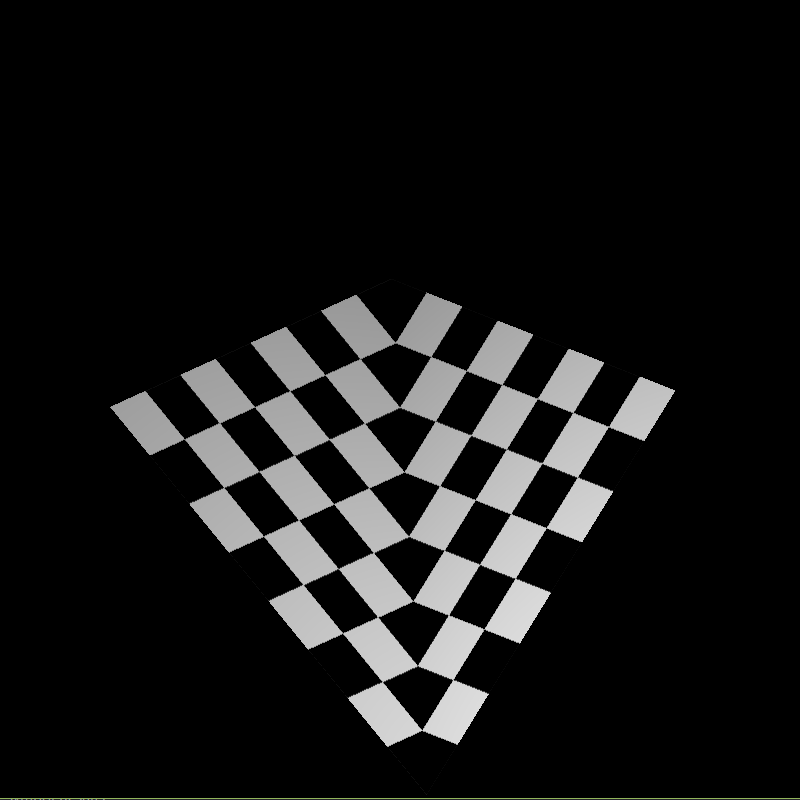 | 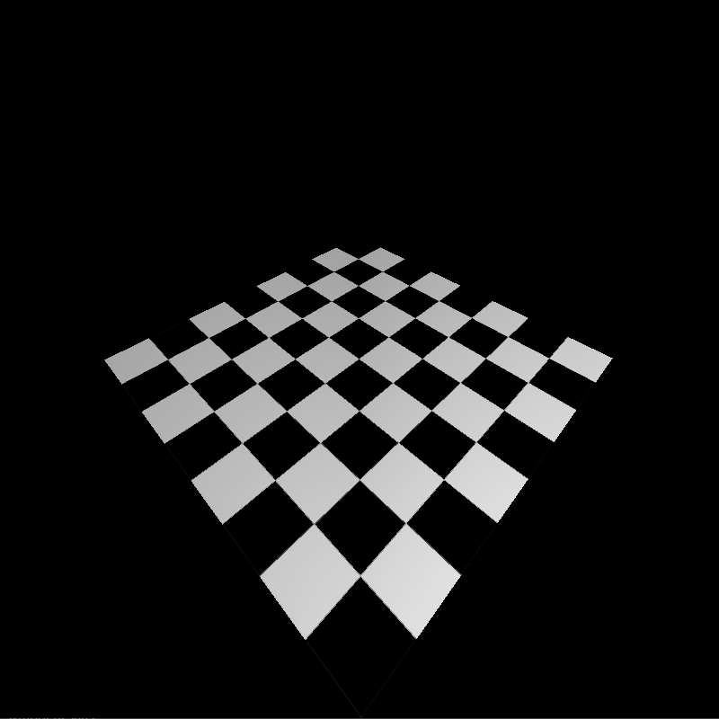 | 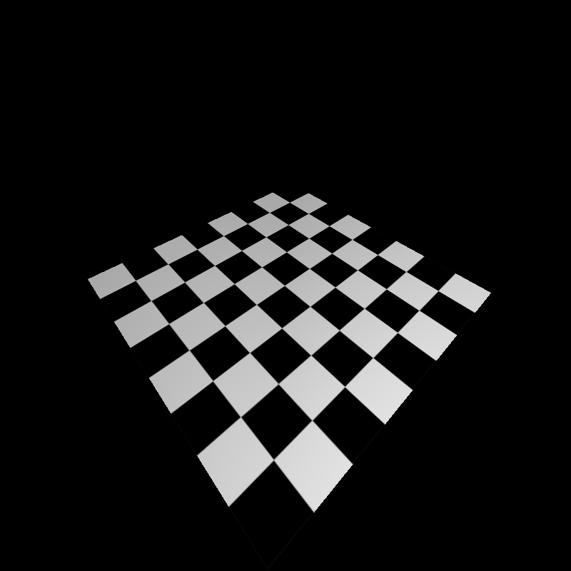 |

#### Point and Line Rendering, and Backface Culling

I chose to implement Point and Line rendering in the rasterizer and not in the primitive assembly. So, it would be easy to change a few lines of code and enable rendering of multiple primitives simultaneously. This can be useful in visual debugging (like wireframe over shaded view in Maya). Line rendering is done using [Digital Differential Analyser (DDA) algorithm](http://www.geeksforgeeks.org/dda-line-generation-algorithm-computer-graphics/).

Also, as can be seen in the third image, I implemented backface culling. Here, we basically remove the triangles that are not facing the camera, to reduce the computational cost. The code has two versions of it. One removes the triangles using stream compaction (thrust::copy_if), and the other one just skips the triangles that are not facing the camera, during rasterization.

| Points | Lines | Backface culling |
| ----- | ----- | ----- |
| 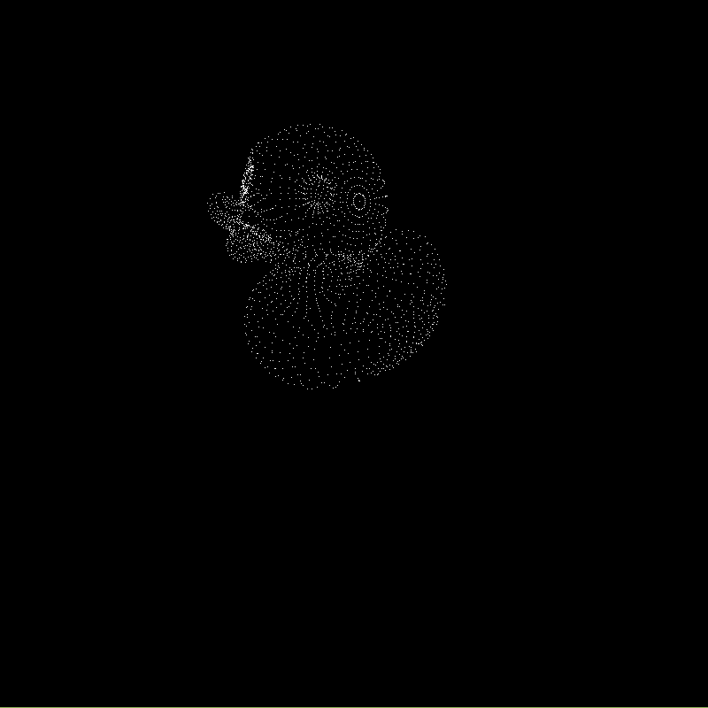 | 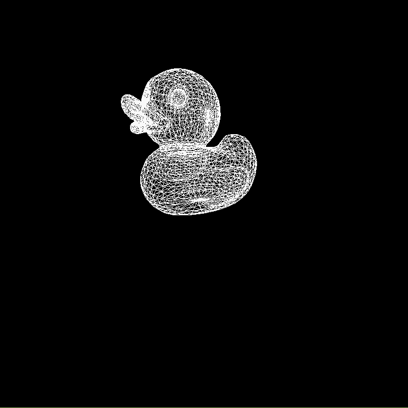 | 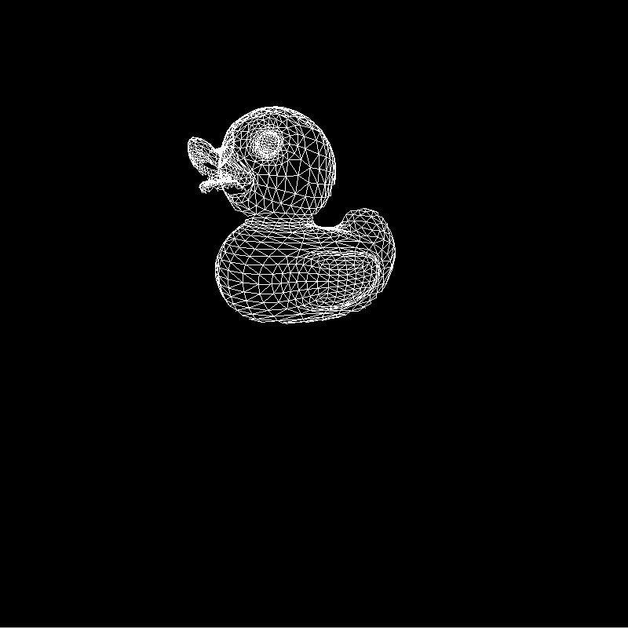 |

** Performance evaluation for backface culling**

|  | Compaction (using thrust) | Rasterization |
| ----- | ----- | ----- |
|Without culling|0.0|1.216|
|Cull without compaction|0.0|1.10222|
|Cull with compaction|1.71259|0.499752|

* Backface culling has some performance boost, but I think it would be much larger with large scenes with complecated meshes.
* After compaction, rasterization is dramatically faster, even for simple meshes. But this comes at the cost of the large compaction overhead. This will only be useful when the scene is too large and the output resolution is also very high.

#### Super Sample Anti-Aliasing

In SSAA, we render the scene at a higher resolution, and then downsample it by averaging neighborhoods to get a smooth image free of jaggies. It is a very inefficient process, and just minimum anti-aliasing would require rendering 4 times larger image.

| No SSAA | SSAA |
| ----- | ----- |
| 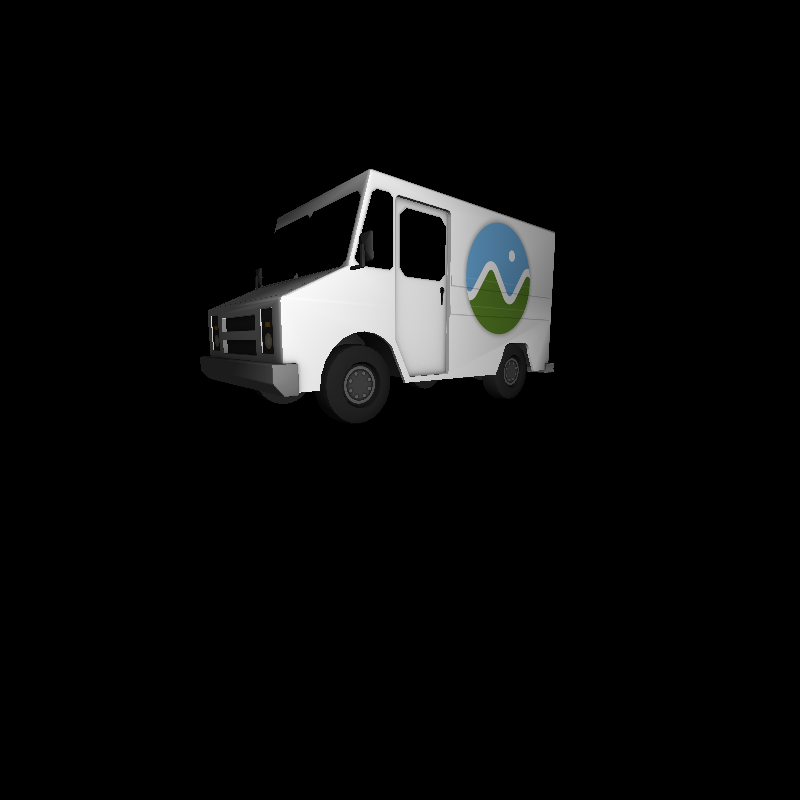 |  |

#### Depth of Field (using Gaussian Blur with shared-memory and Blending)

I imaplemented Gaussian Blur as a two pass process. The first pass blurs along the X-direction, and the second pass blurs along the Y-direction. This gives correct result as Gaussian blur is a seperable operation. Also, applying Gaussian blur multiple times is more efficient than applying bigger kernels. So, my implementation does Gaussian blur over 9x9 pixels twice.

I am using shared memory to store the image so that I dont have to do 9 global memory reads for every thread. I have also implemented a version without shared memory for performance comparison.

Depth of field can be obtained by adding a blend stage between the blur result and output. Here, we interpolate between the original render and the blurred result using depth. The results are not bad, but not realistic. Also, in some scenes, the ringing effect due to Gaussian blur can be seen when the mesh is too close and blurred.

*the grainy result is due to gif compression and is not seen during actual run of the program*

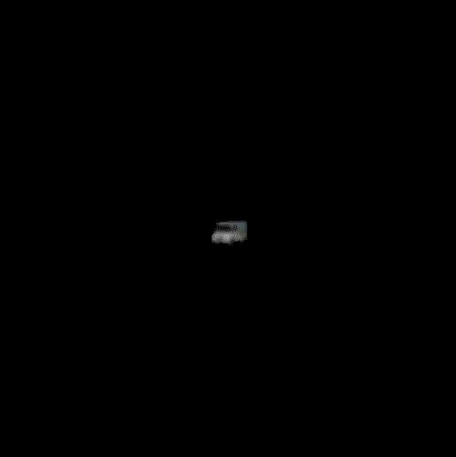

** Performance evaluation for shared memory blurring**

| Without shared memory | With shared memory |
| ----- | ----- |
|6.93293|4.63802|

* As expected, blurring is much faster with shared memory.
* This performance gain would double when we apply the blurring twice for DOF.

### Legendary Bloopers

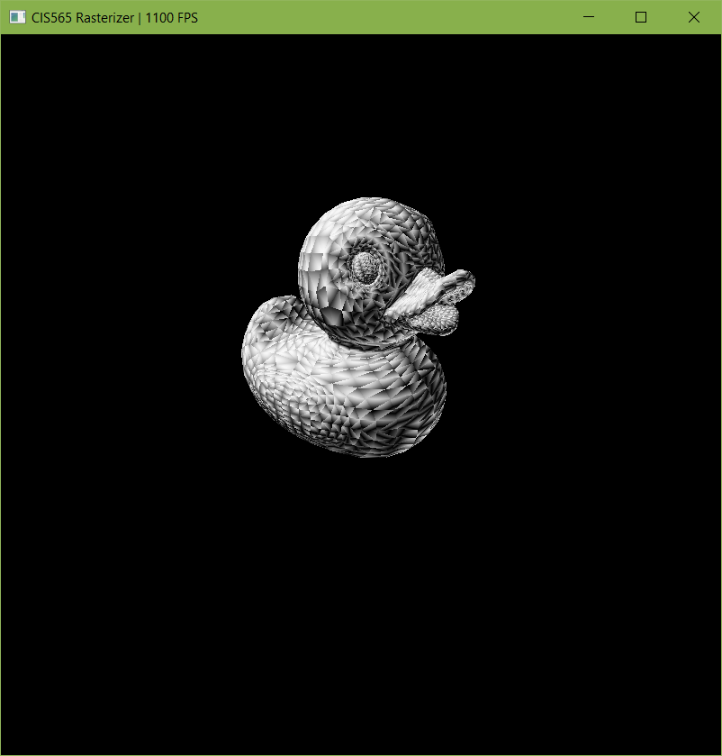

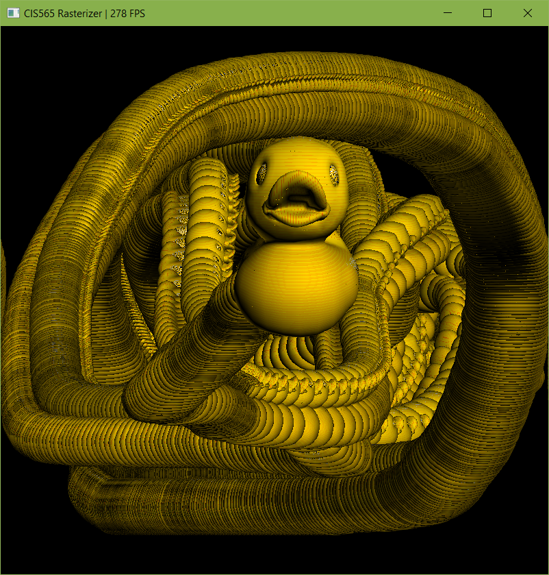

### Credits

* [tinygltfloader](https://github.com/syoyo/tinygltfloader) by [@soyoyo](https://github.com/syoyo)
* [glTF Sample Models](https://github.com/KhronosGroup/glTF/blob/master/sampleModels/README.md)
* [Digital Differential Analyser (DDA) algorithm](http://www.geeksforgeeks.org/dda-line-generation-algorithm-computer-graphics/)
* [Depth of Field](https://mynameismjp.wordpress.com/the-museum/samples-tutorials-tools/depth-of-field-sample/)
* [Shared Memory](https://devblogs.nvidia.com/parallelforall/using-shared-memory-cuda-cc/)
* [Bilinear Texture Filtering](https://en.wikipedia.org/wiki/Bilinear_filtering)
* [Gaussian Blur 1](http://www.sunsetlakesoftware.com/2013/10/21/optimizing-gaussian-blurs-mobile-gpu)
* [Gaussian Blur 2](http://rastergrid.com/blog/2010/09/efficient-gaussian-blur-with-linear-sampling/)
